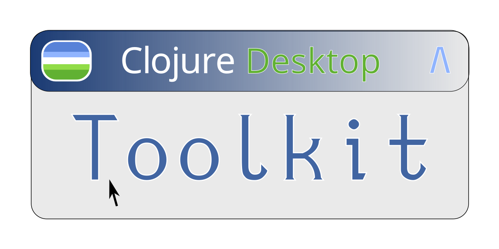
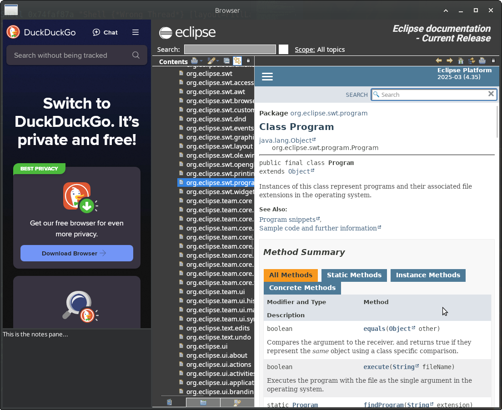

# Clojure Desktop Toolkit

*Version 0.0.2; initial public release; includes full SWT API support*

It used to be that web applications were simpler and easier to build than desktop graphical applications.  With the expectations of modern CSS and Javascript, this is no longer the case.  Modern web applications are beautiful, but they are expensive.

Sometimes a small, fast, lightweight desktop application is just the right thing.

## Sponsor

If you find this work useful or inspiring, please sponsor me or hire me!

## What?

The Clojure Desktop Toolkit wraps Eclipse's SWT library, a cross-platform graphical toolkit utilizing native widgets on each platform.  This enables developers to deliver a high-quality user experience that looks and feels native, because it is.

Clojure Desktop Toolkit also provides an idiomatic functional approach to describing graphical interfaces, greatly reducing the amount of boilerplate one must write to create a rich graphical experience.

A significant barrier to using Eclipse SWT for non-Eclipse applications has been that SWT isn't published on Maven Central.  Clojure Desktop Toolkit solves this probablem by scraping SWT's jars from Eclipse.org and bundling them in our own custom Maven repository.  Shell scripts make it easy to stay up to date.  (This capability originally came from https://github.com/maven-eclipse/maven-eclipse.github.io)

### Example

An application that minimizes itself to the system tray and hosts several panes of information:

```clojure
defn example-app []
  (application ; The application hosts the display object and runs the event loop

   (tray-item ; Define a system tray item so we can minimize to the tray
    (on e/menu-detected [props parent event] (.setVisible (:ui/tray-menu @props) true))
    (on e/widget-selected [props parent event] (let [shell (:ui/shell @props)]
                                                 (.setVisible shell (not (.isVisible shell))))))

   (shell
    SWT/SHELL_TRIM (id! :ui/shell)
    "Browser"
    :layout (FillLayout.)

    (on e/shell-closed [props parent event] (when-not (:closing @props)
                                              (set! (. event doit) false)
                                              (.setVisible parent false)))

    (sash-form
     SWT/HORIZONTAL

     (sash-form
      SWT/VERTICAL
      (browser SWT/WEBKIT (id! :ui/editor)
               :javascript-enabled true
               :url "https://www.duckduckgo.com")

      (text (| SWT/MULTI SWT/V_SCROLL) (id! :ui/textpane)
            :text "This is the notes pane..."
            (on e/modify-text [props parent event] (println (.getText parent))))

      :weights [80 20])

     (browser SWT/WEBKIT (id! :ui/editor)
              :javascript-enabled true
              :url (-> (swtdoc :swt :program 'Program) :result :eclipsedoc))

     :weights [30 70])

    (menu SWT/POP_UP (id! :ui/tray-menu)
          (menu-item SWT/PUSH "&Quit"
                     (on e/widget-selected [parent props event] (swap! props #(update-in % [:closing] (constantly true)))
                         (.close (:ui/shell @props))))))

   (defmain [props parent]
     ;; Bind data layer to UI or...
     (reset! state props)
     (println (str (:ui/editor @props) " " parent)))))


(comment
  (def app (future (example-app))))
```

### Screenshot

The above application running.

Notice how the library automatically supplies links to Eclipse's SWT documentation.  There's also a `(swtdoc)` command for interactively exploring the API from the REPL.




## How do I use it?

Clojure Desktop Toolkit requires Clojure 1.12.0 or later.  (We use its `add-libs` API to dynamically detect, select, and load the correct platform-specific SWT library.)

Currently we support `deps.edn` via the Github transport.  Other artifact repositories are coming.

```clojure
{:paths ["src" "dev"] ; your paths

 :mvn/repos {"clojure-desktop-toolkit"
              {:url "https://coconutpalm.github.io/clojure-desktop-toolkit/maven"}}

 :deps {org.clojure/clojure {:mvn/version "1.12.0"}
        io.github.coconutpalm/clojure-desktop-toolkit {:git/sha "PICK-A-SHA"}}}
```

## Documentation

See the tutorial and API documentation for more.  *(Currently: WIP; in the meantime, see the tests and the examples in the `comment` forms.)*

## Project status

This project is usable, but very early.  Currently, Clojure Desktop Toolkit supports 100% of the SWT API, though there are a few corner cases that require Java interop.

Here's what works well:

* SWT's Webkit-based browser widget works well.  *Goodbye Electron!!!*  There's also a GPL-3 community driven Chromium integration that is said to be stellar.

* The API for constructing a SWT user interface has been stable for awhile now and is unlikely to change much if at all.

### Areas of active work

The following are areas of active work; you can expect breaking changes here:

* The API is mechanically generated at compile time via Java reflection and Clojure macros.  Future work will extend this mechanism to support scraping and generating APIs for custom SWT controls as well.

* Speaking of custom SWT controls, I want to include a rich library of community-written SWT controls from Eclipse's Nebula and E4 projects.

* SWT event handling is currently supported in the usual way: by adding listeners.  A macro eliminates the usual Java boilerplate, and this makes it very convenient to code imperatively. 😁  LOL.

   * Goals for improving this include integrating Missionary via Eclipse Databinding (I was one of Eclipse Databinding's founding engineers/architects).  Maybe an Electric Clojure integration will be in order too!  Hyperfiddle folks--hit me up if you're interested in helping!

* Improved error reporting.  There are a few cases where root causes aren't obvious enough.

* `(swtdoc)` already provides interactive ways to explore the API.  There is a lot of opportunity to improve this with, ehm, *graphical* tools as well.

### Non-goals

* Support for SWT's OpenGL APIs, unless someone else is committed to doing the work and maintaining it. (At least for now.)

# Maintaining an up-to-date SWT repository

This Maven repo is generated by a script that automatically downloads and repackages the official SWT releases.  (Are you starting to detect a pattern here?)

For more information see this [project's parent-fork](https://github.com/maven-eclipse/maven-eclipse.github.io/), but the following should be enough information for someone else to update this if that should become required:

## Prerequisites

*  Maven
*  `aria2`.  On Ubuntu, `sudo apt install aria2`

# How to use

## Scrape new SWT versions

> Note: If you were using [swt-repo on Google Code](http://code.google.com/p/swt-repo/) to maintain a SWT repo, this is a drop in replacement.

More specifically:

```bash
$ ./scrape-check.sh
# stuff scrolls by...

$ ./scrape-swt.sh
# more stuff scrolls by...

$ git add . && git commit -m "your commit message"
```

## Maven

If you're a Java coder and you just want to use SWT in a Maven, Gradle, or Ivy project, you can do that here too!

Add this to your pom.xml: (Gradle, Ivy, and other build systems: The information is the same; adjust for your configuration style.)


```
<repositories>
	<repository>
		<id>eclipse-swt</id>
		<url>https://coconutpalm.github.io/clojure-desktop-toolkit</url>
	</repository>
</repositories>
```

Then add dependencies for each platform you wish to support. The most common are

```
<dependencies>
	<dependency>
		<groupId>org.eclipse.swt</groupId>
		<artifactId>org.eclipse.swt.win32.win32.x86</artifactId>
		<version>${swt.version}</version>
		<!-- To use the debug jar if available, add this -->
		<classifier>debug</classifier>
	</dependency>
	<dependency>
		<groupId>org.eclipse.swt</groupId>
		<artifactId>org.eclipse.swt.win32.win32.x86_64</artifactId>
		<version>${swt.version}</version>
	</dependency>
	<dependency>
		<groupId>org.eclipse.swt</groupId>
		<artifactId>org.eclipse.swt.gtk.linux.x86</artifactId>
		<version>${swt.version}</version>
	</dependency>
	<dependency>
		<groupId>org.eclipse.swt</groupId>
		<artifactId>org.eclipse.swt.gtk.linux.x86_64</artifactId>
		<version>${swt.version}</version>
	</dependency>
	<dependency>
		<groupId>org.eclipse.swt</groupId>
		<artifactId>org.eclipse.swt.cocoa.macosx.x86_64</artifactId>
		<version>${swt.version}</version>
	</dependency>
</dependencies>
```
