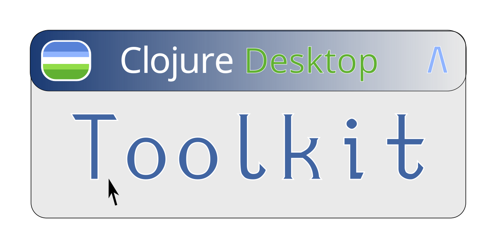
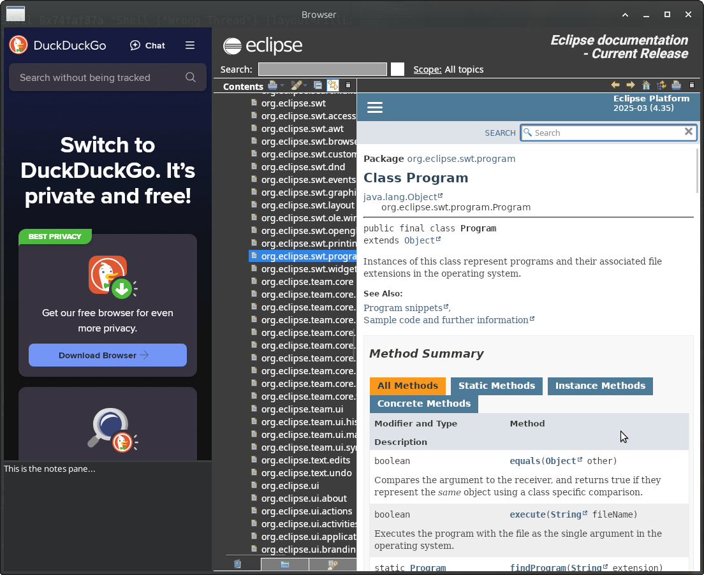

# Clojure Desktop Toolkit

> ***Returning joy to desktop application development!*** 😁

[](https://clojars.org/io.github.coconutpalm/clojure-desktop-toolkit)
[](https://hypercommit.com/clojure-desktop-toolkit)

* **[New and Noteworthy](docs/new-and-noteworthy/version-0.4.4.md)** - We package SWT libraries inside your Uberjar and automatically select the right one!  More!
* **[Current documentation](docs/000-index.md)** or see below for a brief synopsis.

Web applications used to be simpler and easier to build than desktop graphical applications.  With the expectations of modern CSS and Javascript, this is no longer the case.  Modern web applications are beautiful, but they are expensive.

Sometimes a small, fast, lightweight desktop application is just the right thing.  Clojure Desktop Toolkit makes it easy to create fast, native, cross-platform user interfaces based on Eclipse's SWT libraray.

## Sponsorship

If you find this work useful or inspiring, please [sponsor me](https://github.com/sponsors/coconutpalm) or hire me!

## What?

The Clojure Desktop Toolkit wraps [Eclipse's SWT library](https://eclipse.dev/eclipse/swt/), a cross-platform graphical toolkit utilizing native widgets on each platform.  This enables developers to deliver a high-quality user experience that looks and feels native, because it is.

Clojure Desktop Toolkit also provides an idiomatic functional approach to describing graphical interfaces, greatly reducing the amount of boilerplate one must write to create a rich graphical experience.

A significant barrier to using Eclipse SWT for non-Eclipse applications has been that SWT isn't published on Maven Central.  Clojure Desktop Toolkit solves this problem by including SWT's libraries as a resource in your program and automatically resolving/loading the correct ones.

### Example

(If you want to jump straight to [the tutorial](docs/000-index.md), you can.)

An application that minimizes itself to the system tray and hosts several panes of information:

```clojure
(defn example-app []
  (application ; The application hosts the display object and runs the event loop

   (tray-item ; Define a system tray item so we can minimize to the tray
    (on e/menu-detected [props parent event] (.setVisible (:ui/tray-menu @props) true))
    (on e/widget-selected [props parent event] (let [shell (:ui/shell @props)]
                                                 (.setVisible shell (not (.isVisible shell))))))

   (shell
    SWT/SHELL_TRIM (id! :ui/shell)
    "Browser"
    :layout (FillLayout.)

    (on e/shell-closed [props parent event] (when-not (:closing @props)
                                              (set! (. event doit) false)
                                              (.setVisible parent false)))

    (sash-form
     SWT/HORIZONTAL

     (sash-form
      SWT/VERTICAL
      (browser SWT/WEBKIT (id! :ui/editor)
               :javascript-enabled true
               :url "https://www.duckduckgo.com")

      (text (| SWT/MULTI SWT/V_SCROLL) (id! :ui/textpane)
            :text "This is the notes pane..."
            (on e/modify-text [props parent event] (println (.getText parent))))

      :weights [80 20])

     (browser SWT/WEBKIT (id! :ui/editor)
              :javascript-enabled true
              :url (-> (swtdoc :swt :program 'Program) :result :eclipsedoc))

     :weights [30 70])

    (menu SWT/POP_UP (id! :ui/tray-menu)
          (menu-item SWT/PUSH "&Quit"
                     (on e/widget-selected [props parent event]
                        (swap! props assoc :closing true))
                        (.close (:ui/shell @props))))))

   (defmain [props parent]
     ;; Bind data layer to UI or...
     (println (str (:ui/editor @props) " " parent)))))


(comment
  (def app (future (example-app))))
```

### Screenshot

The above application running.

Notice how the library automatically supplies links to Eclipse's SWT documentation.  There's also a `(swtdoc)` command for interactively exploring the API from the REPL.



## Project status

Currently, Clojure Desktop Toolkit supports 100% of the SWT API.  Places that require Java interop are generally pleasant to work with.

This project is usable, but still very early.  I am using it as the foundation for another project.  If anyone else uses it for a utility, project, or whatever, please contact me and I'll link to you here!

Here's what works well:

* The API for constructing a SWT user interface has been stable for awhile now and is unlikely to change much if at all.

* Event handling the traditional way.

* SWT's Webkit-based browser widget works well.  *Goodbye Electron!!!*  There's also a GPL-3 community driven Chromium integration that is said to be stellar.

### Areas of active work

The following are areas of active work; you can expect breaking changes here:

* The API is mechanically generated at compile time via Java reflection and Clojure macros.  Future work will extend this mechanism to support scraping and generating APIs for custom SWT controls as well.

* Speaking of custom SWT controls, I want to include a rich library of community-written SWT controls from Eclipse's Nebula and E4 projects.

* SWT event handling is currently supported in the usual way: by adding listeners.  A macro eliminates the usual Java boilerplate, and this makes it very convenient to code imperatively. 😁  LOL.

   * Goals for improving this include integrating Missionary via Eclipse Databinding (I was one of Eclipse Databinding's founding engineers/architects).  Maybe an Electric Clojure integration will be in order too!  Hyperfiddle folks--hit me up if you're interested in helping or hiring me!

* `(swtdoc)` already provides interactive ways to explore the API.  There is a lot of opportunity to improve this with, ehm, *graphical* tools as well.

### Non-goals

* Support for SWT's OpenGL APIs, unless someone else is committed to doing the work and maintaining it. (At least for now.)

# Maintaining an up-to-date SWT repository

As-of version 0.4.4, we have deprecated and removed the SWT Maven repository.  See the [corresponding N&N](docs/new-and-noteworthy/version-0.4.4.md) for details.
