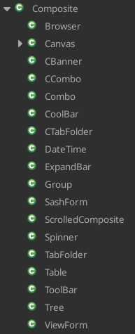

#  The SWT WIdget Hierarchy

This page is a quick reference to SWT's `Widget` class hierarchy.

## Top-level highlights

## Composites

Composites are controls that can contain other controls.  Custom controls also usually extend `Composite` or `Canvas`.

Within SWT, custom controls have a "C" prefix.  `CBanner`, `CCombo`, etc., are examples.

## Canvas

`Canvas` is the superclass of controls that are designed to be be drawn on using a graphics context, or `GC`.

[Return to documentation index](000-index.md)
