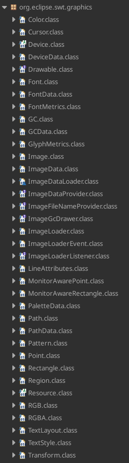

#  Graphics and drawing

These classes are typically used for drawing custom things on a `Canvas` or `Drawable` using a `GC`, or Graphics Context.

Some things (like colors and fonts) may also be assigned to properties of regular SWT widgets.

[Return to documentation index](index.md)
