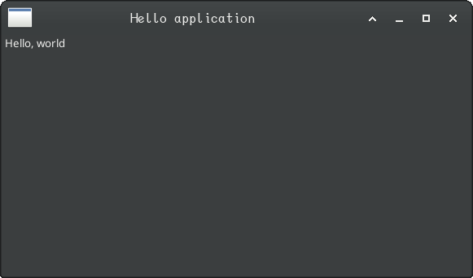

# A "Hello, world" application

It is traditional to introduce programming using a new programming language or user interface toolkit using an application that simply displays the message, "Hello, world".

In Clojure Desktop Toolkit, this application illustrates how to:

* Create a hierarchy of user interface widgets.
* Specify SWT style bits for a widget's constructor.
* Set JavaBean properties on widgets, along with syntactic sugar that Clojure Desktop Toolkiet offers.

Here is the code:

```clojure
(defn hello []
  (application                              ; (1)
   (shell SWT/SHELL_TRIM                    ; (2, 3)
          "Hello application"               ; (4)

          :layout (FillLayout.)             ; (5, 6)

          (label "Hello, world"))))         ; (7)
```

Here's what this looks like when running on Linux:



Although this application seems trivial, it already illustrates many of the main features of the Clojure Desktop Toolkit.

Let's examine each expression (numbered above) and see what we can learn:

1. The `application` function creates the underlying SWT `Display` object and runs the event loop as long as there is at least one top-level window open.

2. A `shell` can be a top-level window, a dialog box, a borderless window, a child window of another window, and so forth.  This one is the `application`'s child.

3. `SWT/SHELL_TRIM` All SWT user interface widgets share the same constructor signature: `(parent, style-bits)`.
   * In Clojure Desktop Toolkit, `parent` is automatically supplied from the parent in the call tree.  That is why this parameter doesn't appear explicitly in our code.
   * For top-level `shell` objects, this parent is the application's `Display`.
   * `SWT/SHELL_TRIM` is the `style-bits` we're passing here.  This parameter is an integer bitmap that selects features to enable for the thing being constructed.
      * `SWT/SHELL_TRIM` is a convenience value for the bits normally used to designate an application top-level shell.
      * In the general case, style bits can be bitwise-or'd together to enable multiple features.
      * Unlike Java, in Clojure Desktop Toolkit, if this prameter is omitted, the tookit automatically passes `SWT/NONE`.

4. `"Hello application"` If a string appears by itself (e.g.: is not being explicitly set into a property), it is set into its parent's `text` JavaBeans property.  e.g.: This bare string is equivalent to roughly the following Java code:

```java
theShell.setText("Hello application");
```

5. `:layout` Clojure keywords name a JavaBean property to set using the value specified by the following parameter.

6. Here we're using Java interop to directly construct a `FillLayout` to set into the `layout` property.  e.g.: (5) and (6) combine to effectively write:

```java
theShell.setLayout(new FillLayout());
```

7. `(label` creates a SWT `Label` widget as a child of the shell using `SWT/NONE` style bits.  Since `"Hello, world"` isn't assigned to a particular property, it is set into the label's `text` property like `"Hello application"` was above.  SWT's naming consistency makes conventions like this within Clojure Desktop Toolkit possible, pleaseant, and effective.

## Run the application

To run this application from within a Clojure `-main` function, simply call it.

To run this application from the REPL, one must create a separate thread for it to avoid blocking the REPL thread while the application is running.  Here's a comment form one can use for this purpose:

```clojure
(comment
  "Run the `hello` application"
  (def app (future (hello)))

  :eoc)
```

# Conclusion

"Hello, world" has illustrated several principles:

* In Clojure Desktop Toolkit, a user interface hierarchy is written as nested function calls corresponding to the hierarchy of the user interface widgets.
* Widget parameters that don't create child widgets set properties of the parent object.  Normally the property to set is determined by a keyword parameter (e.g.: `:layout`) preceeding the value to set.
* For some data types, the precise property being set is determined by convention.  For example, bare strings are always assigned into the `text` JavaBeans property of their parent.

Although we haven't fully seen this in action, Clojure names are identical to the corresponding Java names, but in `kebab-case` form.

## Next steps

At this point, you might be appreciating the clarity and succinctness of code written using Clojure Desktop Toolkit.  At the same time, you may feel like all of the syntactic sugar is obscuring what is happening under the hood.

In our next episode, we'll pull back the curtain and rewrite "Hello, world" without using any of Clojure Desktop Toolkit's syntax sugar.  You'll see exactly what the library is doing and learn how you can extend it yourself--the same way it was written itself.